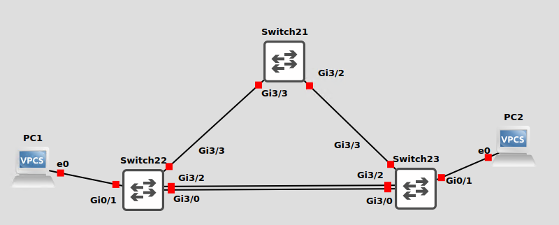

# Managed Switches

As you already know, a Managed Switch is a device with network hardware for switching, and a computer which can be used to configure the switching hardware. The whole point of a managed switch, is that is it configurable. And we need to be able to manage it across the network. We are going to need to set a management address on the switch's CPU.

I configure Switch21 as shown. Configure Switch22 and 23 using the switch numbers as the last octet in their network address.

```
# Switch 21
en
conf t
int vlan 1
ip address 192.168.1.21 255.255.255.0
no shut
exit
exit

```

Do a ping test from Switch21 to see if everything is working.

<figure><figcaption></figcaption></figure>

Test after you complete each stage of work!
